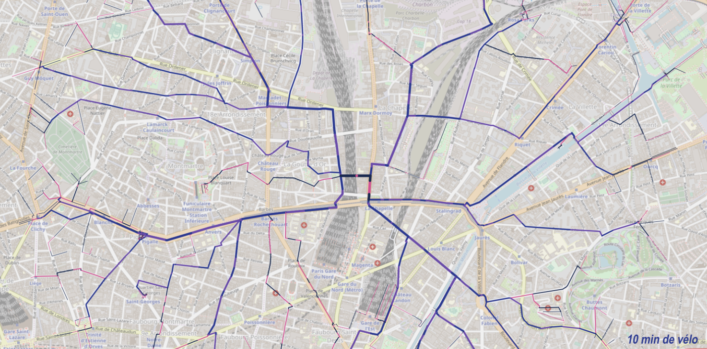

# nervure
Ways home with graphhopper engine

4h driving

10min by bike

## Frontend
React app with Leaflet.

## Backend
Isochrone resource extended from [Graphhopper](https://www.graphhopper.com/).

To start the engine see the [graphhopper doc](https://github.com/graphhopper/graphhopper/blob/master/docs/core/quickstart-from-source.md)